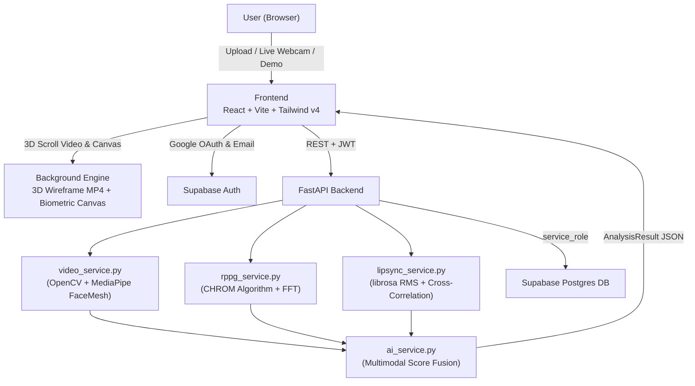

# Pulsevein — Multimodal Deepfake Reality Checker Documentation

## Problem Statement & 2026 Reality

In 2026, generative diffusion deepfakes have defeated pixel-level artifact detectors. Synthetic video generation produces artifact-free frames at production threshold accuracy. Journalists, content moderators, and fact-checkers require a non-pixel biometric detector.

## What Pulsevein Does Differently

**Pulsevein cross-references two physiological signals that require simulating human biology:**

1. **Remote Photoplethysmography (rPPG)** — Subtle micro-color oscillations in cheek and forehead skin caused by cardiac blood flow. Real human video exhibits periodic frequency peaks (40–150 BPM) with high spectral coherence. Deepfakes produce smooth pixels lacking arterial blood pulsation.

2. **Audio-Visual Lip-Sync Coherence** — Frame-by-frame cross-correlation between 3D face mesh lip landmarks (MediaPipe) and audio spectrogram energy envelopes (librosa RMS). AI voice clones and face swaps exhibit millisecond phase shifts and desynchronization spikes ($>2\sigma$).

## Key Features & User Interface

- **3D Scroll-Rotating Video Background**: Features wireframe face scanning animation (`bg.mp4`) that rotates dynamically in 3D as the user scrolls.
- **Flagship Multimodal Scanner**: Accepts video file uploads or live webcam bio-scans with real-time rPPG pulse node overlays.
- **Google Sign-In & Supabase RLS Auth**: One-click Google OAuth authentication and email/password login backed by Postgres Row-Level Security.
- **Forensic Decision Breakdown**: Every analysis result details exact physical blood flow signals, lip-sync desync timestamps, and recommended next actions.
- **Preloaded Demo Scenarios**: Built-in verification clips for instant presentation without external dependencies.

## Technical Architecture



## Live Deployment Links

- 🌐 **Vercel Live Frontend App**: [https://frontend-ochre-kappa-13.vercel.app](https://frontend-ochre-kappa-13.vercel.app)
- ⚡ **FastAPI Backend API Docs**: [http://127.0.0.1:8000/docs](http://127.0.0.1:8000/docs)

## Running the Application

### Frontend (Live on http://localhost:5173)
```bash
cd frontend
npm run dev
```

### Backend (Port 8000)
```bash
cd backend
pip install -r requirements.txt
uvicorn main:app --reload --port 8000
```
